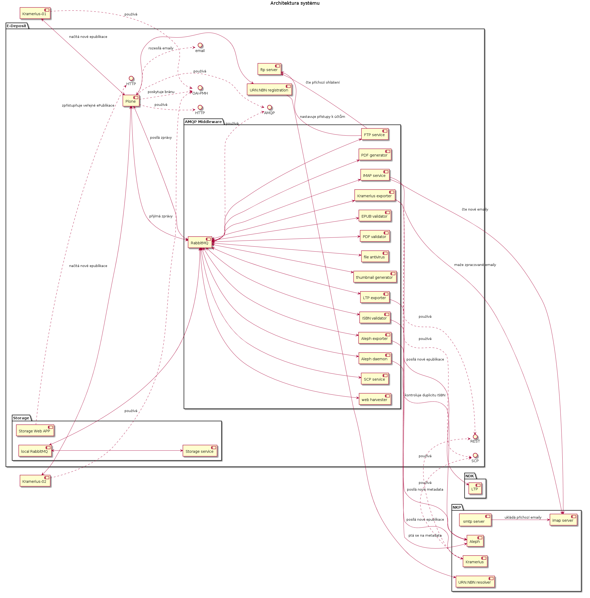

.. _architecture:

Architektura systému
-------------------------------------

.. toctree::
   :maxdepth: 2



Servery a služby
```````````````````````````````

:edeposit-aplikace.nkp.cz:
   sever, na kterém běží produkční aplikace. Producenti se obrací na
   tento server.

:edeposit-test.nkp.cz:
   server, na kterém probíhá testování. 
   - server je napojen na testovací bázi v =Alephu=
   - programátoři na tomto serveru nasazují nové změny
   - ... a testeři je na tomto serveru testují

:edeposit-vyvoj.nkp.cz:
   server, na kterém probíhá vývoj. Vývojáři na něm mohou zkoušen nové
   věci.

:edeposit-storage.nkp.cz:
   server, na který se ukládají originály ePublikací.
   - jedná se o velkokapacitní úložiště
   - úložiště je zálohované s ohledem na dlouhodobou ochranu dat
   - na tomto serveru se zpřístupňují veřejně dostupné ePublikace

:10.1.2.183:
   smtp relay vnitřní pošty

:aleph.nkp.cz:
   server, který poskytuje knihovnická data o všech publikacích.

:resolver.nkp.cz:
   server poskytuje jednoznačnou identifikaci ePublikací
   - poskytuje informace o všech místech, kde je možno dotyčnou
     ePublikaci nalézt.

:ltp.nkp.cz:
   server zajišťující dlouhodobou ochranu ePublikací ve smyslu 
   "Long Term Preservation"


.. raw:: html

