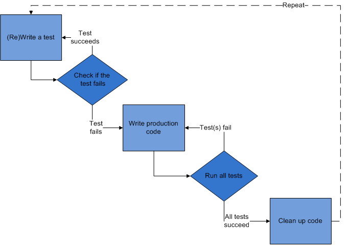

.. _development:

Proces vývoje
-------------------------------------

Vývoj probíhá podle metodiky `Test Driven Development <http://en.wikipedia.org/wiki/Test-driven_development>`_.
   

"Test-driven development" by Excirial (Contact me, Contribs) - Own work (Original text: I created this work entirely by myself.). 

Licensed under CC BY-SA 3.0 via Wikimedia Commons

http://commons.wikimedia.org/wiki/File:Test-driven_development.PNG#mediaviewer/File:Test-driven_development.PNG

Hlavní myšlenkou této metodiky je "testování jako aktivní součást vývoje".

Každá část kódu, dříve než vznikne, by měla mít odpovídající test.

Postup
~~~~~~~~~~~

1. akceptační test

     - akceptačním testem se popíše chování kódu. 
     - protože kód není napsán, test v této fázi končí neúspěchem

2. programování kódu

   - programátor si pouští akceptační test a programuje
   - test kontroluje chování systému
   - v okamžíku, kdy akceptační test skončí úspěchem, programátor splnil svoji práci 
   - kód je napsán a vyhovuje akceptačnímu testu

3. při nasazení musí všechny testy skončit úspěchem

   - tím se zajistí, že nově napsaný kód neovlivnil jiné části systému

4. Po nasazení je čas kód sjednotit se zbývajícími částmi systému

   - aby kód byl nejen funkční, ale aby byl i v souladu s celkovým stylem vývoje

Výhody
~~~~~~~~~~~

- zkrácení cyklu vývoje
- chyby se při vývoji neopakují, protože jejich nový výskyt odhalí testy
- nehrozí, že se již jednou objevená chyba projeví
- testy zajistí, že se chování systému při novém nasazení nezmění
- akceptační testy slouží jako dokumentace pro programátory i návrháře systému

Akceptační testy
~~~~~~~~~~~~~~~~~~~~~~~~~~~~~~~~~~~

:ref:`Akceptační testy projektu <acceptancetests>`

Pro zápis akceptačních testů i integračních testů projekt využívá `Robot Framework <http://robotframework.org>`_

Výhody

   - testy jsou čitelné i pro zadavatele
   - testy se mohou účastnit analytické částí
   - testy se snadno udržují

Integrační testy
~~~~~~~~~~~~~~~~~~~~~~~~~~~~~~~~~~~

:ref:`Integrační testy projektu <integrationtests>`

Integrační testy slouží ke kontrole funkce celku.

Testy mají za úkol odhalit problémy při spolupráci jednotlivých součástí aplikace.

.. raw:: html

	

	
	<noscript>Please enable JavaScript to view the <a href="http://disqus.com/?ref_noscript">comments powered by Disqus.</a></noscript>
	<a href="http://disqus.com" class="dsq-brlink">comments powered by Disqus</a>
    

